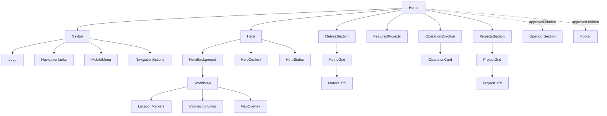
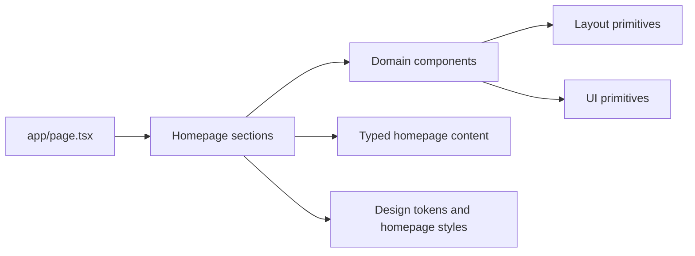

# Homepage migration record

## Scope

Sprint 3 migrates the approved static homepage into the Next.js App Router without
changing its visual direction or publishing new product areas.

## Preserved decisions

- The original world-map artwork is copied unchanged into `public/`.
- The original section order, copy, metrics, project ordering, and responsive
  breakpoints are preserved.
- The operator section and footer remain hidden on the homepage because they are
  hidden in the approved static implementation. Both are independently available
  in Storybook.
- Links whose destination pages are outside this sprint resolve to the existing
  `/coming-soon` experience.
- Inter and Orbitron are self-hosted so the approved typography does not depend on
  a third-party request at runtime.

## Component hierarchy

## Dependency direction

Homepage content is data-first and typed. Section components may depend on
layout/UI primitives and content, while primitives do not depend on homepage
sections.

## Storybook coverage

Stories are organized under `Homepage/` for navigation, hero, world map, metrics,
operations, projects, operator, and footer. Existing `UI/` stories continue to
cover the shared primitives.

## Sprint 4 review items

- Decide whether operator and footer content should become visible.
- Replace `/coming-soon` destinations only as their routes are approved.
- Review animation polish after migration approval; Sprint 3 retains lightweight
  static-site motion only.
- Establish screenshot-based visual regression thresholds after the migrated
  homepage is accepted as the new baseline.
