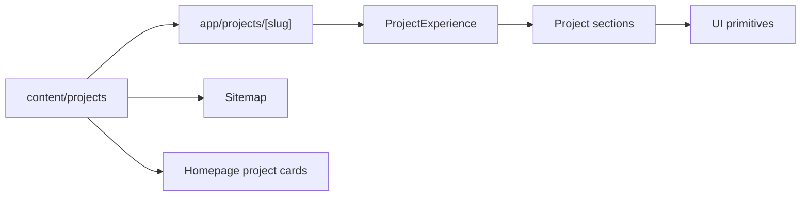

# Sprint 5 project experience platform

## Architecture

One structured project registry feeds one statically generated dynamic route and
one composed `ProjectExperience` renderer. Domain sections accept only the data
they need and share a single visual system.

## Example

`/projects/enterprise-home-lab` demonstrates the complete report structure with
objectives, architecture, technology stack, timeline, decisions, lessons,
evidence placeholders, code, downloads, roadmap, and related projects.

Seven additional records exercise the planned-state presentation without
inventing implementation results.

## Performance impact

- All eight routes are prerendered with `generateStaticParams`.
- No runtime dependencies were added.
- No client component or client-side state was added.
- Expandable architecture uses native `details`.
- Gallery links provide a lightbox integration seam without shipping a lightbox.
- Placeholder media does not create image requests.

## Accessibility impact

- Project structure uses semantic header, navigation, main, sections, lists,
  figures, definition lists, time elements, and footer landmarks.
- Section navigation is keyboard accessible and horizontally scrollable.
- Architecture expansion uses native keyboard behavior.
- Code examples are keyboard-scrollable.
- Visible focus styling and reduced-motion behavior are included.

## Technical debt

- Real screenshots, videos, downloads, and measured outcomes are intentionally
  absent until engineering evidence exists.
- The framework supports image-link lightbox integration but does not implement a
  modal viewer.
- Architecture is currently an accessible node/connection report rather than an
  interactive canvas.
- Certification references are modeled but not rendered until their placement is
  approved.

## Sprint 6 recommendations

- Populate the Enterprise Home Lab foundation milestone with sanitized evidence.
- Add the first versioned architecture brief and validation checklist.
- Define an asset review/redaction workflow before publishing screenshots.
- Add visual regression snapshots after this project experience is approved.
